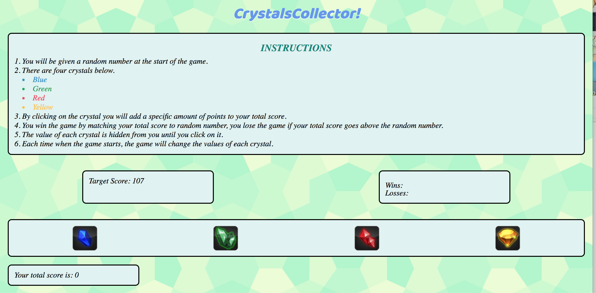

# CrystalsCollector Game

## Table of Contents 
1. [Overview](#overview)
2. [Technologies](#technologies)
3. [Local Installation](#installation)
4. [App Display](#display)

## Overview
CrystalsCollector is a game project created using the knowledge of HTML, CSS, JavaScript, and jQuery. Player is presented with four crystals, each gives a random value from 1 to 12, as the user clicks it. Target number is also a random value from 19 to 120. For each game, values of each crystal and target number are different. 

The goal of the game is to match your score to the target number, by adding the scores given by the crystals clicked. User wins when the sum adds up to the target number. 

## Technologies
* Google fonts
* Media queries
* Math.floor(Math.random()
* $('').text()
* $('').on("click", function())
* Create a function to update "You won" or "You lost"
* Create a function to reset HTML elements

## Installation
Download the files to your computer from https://github.com/hyxhuynh/unit-4-game and open index.html using your browser (eg. Google Chrome)

Or visit: https://hyxhuynh.github.io/unit-4-game/

## Game Display

